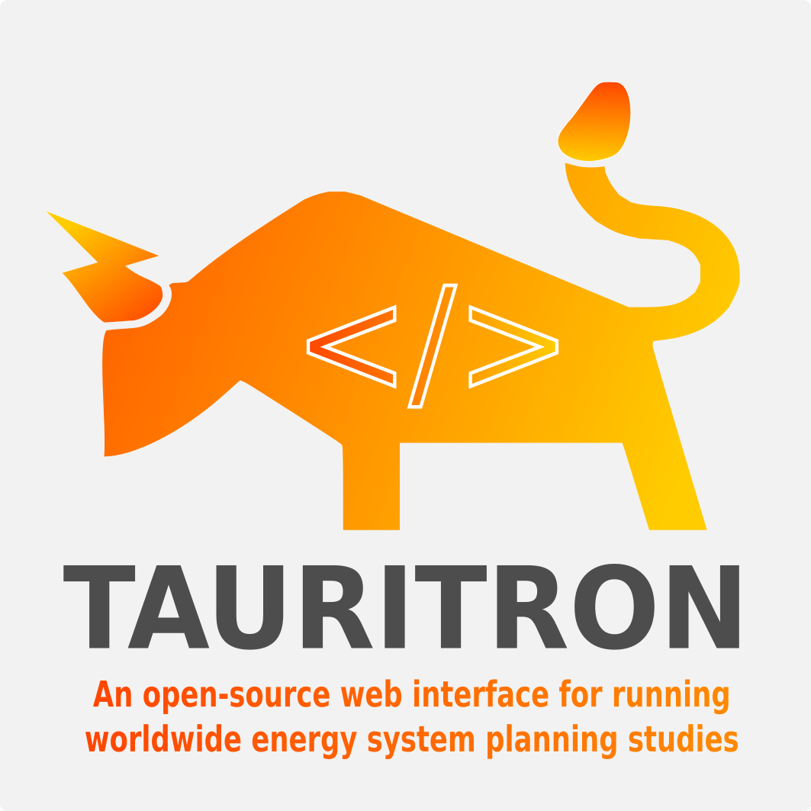

# Tauritron
<!-- An open-source web interface for running worldwide energy system planning studies -->

## Short project description
The open source project puts the human back at the center of energy planning decisions. This project will improve how people interact with energy data, enable simple calculations and visualizations, promote public engagement, and improve human-centered decision making. Specifically, the project aims to develop a graphical web interface for the popular open-source energy system model, PyPSA, which is used in research and industry worldwide. After successful development, the open-source developments can be adapted by any other tool.

## What societal challenges we want to address?
Achieving net zero emissions requires advanced modeling capabilities to capture the complex interactions between electricity, gas, and heat. With the insights of such modeling tools, various technical, policy, and regulatory decisions are currently being made. The market for such modeling tools is currently dominated by expensive and opaque "black-box" solutions that are heavily criticized in academia and industry as well as exclude citizens and other stakeholders in the decision-making process. While a number of open-source energy models with increased complexity have been recently developed to support sustainable and cost-effective decision-making, a common shortcoming is the lack of consideration of the ability of humans to understand and question the complicated results. Open-source tools are currently not user-friendly and failing to address these issues can lead to poor decisions, misunderstandings, and trust issues in the energy policy arena. A solution is particularly urgent given the current energy crisis and skyrocketing electricity bills.

## Technical implementation plan:
The webinterface will be developed on a stable version of PyPSA-Earth. The model developed in 2022 is the first of its kind to use rich spatial and temporal data to create representative energy systems around the world for transparent energy system planning. The graphical user interface should allow modification of option files via a front end, execution of large-scale optimizations in the cloud, and summaries and explorations of results. A plug-in architecture should allow to build purpose-driven and report-ready statistics, visuzalizations and figures. For the complex optimization, HiGHS will be integrated as the world's fastest solver, D3.js for graphics, Mapbox, Leaflet and Natural Earth for maps, Plotly, Matplotlib, Xarray for output plots, Holoviews for interactive exploration of results and free software for server infrastructure (GNU/Linux, nginx, Flask, Gunicorn, Redis) were used.

- **01.03.2023 Project start.** Test existing EU front-end project to design detailed plan for global model integration and improvements. Exchange with stakeholders/users like Agora Energiewende and Transition Zero and users from the global south. Goal is to clearly define the requirements and to build an exchange partner for the development
- **01.04.2023 Development start.**
- **01.05.2023 Alpha version presentation.** Model is integrated into a front-end, architecture is clear and visible.
- **01.06.2023 Beta version presentation.** Design, viz-art and functions are improved.
- **01.08.2023 Demo day preparation.** Live version should be ready. Documentation is perfected.
- **01.09.2023 Demo day presentation.**

## Sponsor
Sponsored by BMBF through the [Prototypefund 2023 round 13](https://prototypefund.de/project/tauritron/).
 

